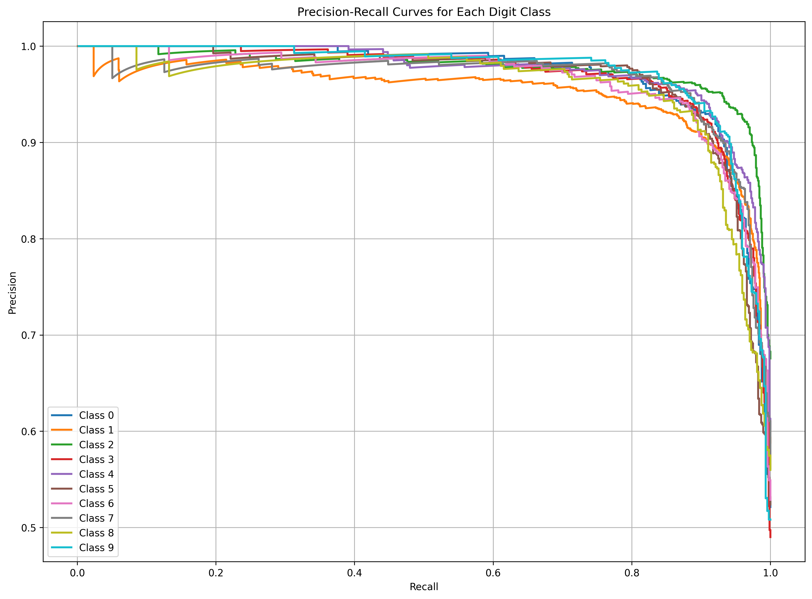
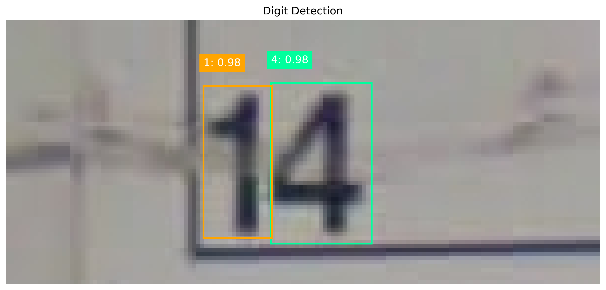

# Visual Recognition using Deep Learning Homework 2 Report

[GitHub Repository link](https://github.com/dytsou/vrdl2025/tree/master/hw2)

## 1. Introduction

### 1.1 Task Description
This project implements a digit recognition system using the Faster R-CNN model. The goal is to detect and recognize digits in images, which is essential for various applications like number plate recognition, digit extraction from documents, and more. The approach leverages object detection techniques to first locate digits within an image and then classify them.

### 1.2 Core Idea
The main motivation is to develop a robust system that can accurately identify digits in various contexts, handling challenges such as different fonts, orientations, and image quality variations. This implementation specifically focuses on using a lightweight architecture to balance accuracy and computational efficiency.

## 2. Method

### 2.1 Data Pre-processing
The data preprocessing pipeline handles images and annotations in COCO format:

- Standardized image resizing to 800×800 pixels
- Normalization using standard ImageNet means and standard deviations
- Comprehensive data augmentation techniques implemented with albumentations library:
  - Random brightness and contrast adjustments
  - Horizontal flipping (with 0.5 probability)
  - Random rotation (±20 degrees with 0.7 probability)
  - Random scaling (0.7-1.3× with 0.7 probability)
  - Random hue shifts (±0.1 with 0.5 probability)
  - Gaussian blur (with 0.3 probability)
  - ShiftScaleRotate transformations
  - Grid distortions
  
The DigitDataset class handles loading images and annotations, converting bounding box formats from COCO [x_min, y_min, width, height] to the format required by Faster R-CNN [x_min, y_min, x_max, y_max].

### 2.2 Model Architecture
The architecture uses an improved version of Faster R-CNN with the following components:

- **Backbone**: MobileNetV3 Large with FPN (Feature Pyramid Network)
  - Chosen for its lightweight nature while maintaining good feature extraction capabilities
  
- **Region Proposal Network (RPN)**:
  - Custom anchor sizes: (8, 16, 32, 64, 128, 256)
  - Custom anchor ratios: (0.5, 0.8, 1.0, 1.25, 2.0)
  - RPN NMS threshold: 0.6
  - RPN foreground IoU threshold: 0.6
  - RPN background IoU threshold: 0.4
  
- **Head**:
  - Standard Fast R-CNN head replaced with a custom FastRCNNPredictor
  - ROI output size: 7
  - ROI NMS threshold: 0.4
  - ROI score threshold: 0.05

### 2.3 Training Configuration
- Batch size: 8
- Number of epochs: 30
- Initial learning rate: 0.005
- Learning rate scheduler: StepLR (step size 10, gamma 0.1)
- Optimizer: SGD with momentum 0.9 and weight decay 0.0001
- Early stopping patience: 5 epochs

This architecture was chosen because MobileNetV3 provides a good balance between accuracy and computational efficiency. The custom anchor sizes and ratios were specifically designed to better detect digits of various sizes and aspect ratios.

### 2.4 Implementation Details

#### 2.4.1 Training Environment
- Python with PyTorch
- CUDA support for GPU acceleration
- Libraries: torchvision, albumentations, pycocotools, matplotlib

#### 2.4.2 Special Techniques
- Early stopping to prevent overfitting
- Learning rate scheduling for better convergence
- Mixed precision training (when using CUDA)
- Data augmentation to improve model generalization
- Checkpoint saving for model persistence

#### 2.4.3 Inference Pipeline
- Post-processing to convert predictions to COCO format
- Number recognition by ordering detected digits from left to right
- Prediction filtering based on confidence score threshold

## 3. Results

### 3.1 Model Analysis
The model achieves competitive results on the evaluation metrics:

| Metric | Score |
|--------|--------------|
| mAP    | 0.36        |
| Accuracy | 0.77      |

### 3.2 Training Characteristics

#### 3.2.1 Training and Validation Curves
The model's training process can be visualized through the training and validation loss curves. These curves provide insight into the model's learning behavior and convergence.

In addition to loss, we tracked the mean Average Precision (mAP) on the validation set throughout training:

#### 3.2.2 Precision-Recall Analysis
Precision-recall curves for each digit class help understand the model's performance across different confidence thresholds.

#### 3.2.3 Confusion Matrix
The confusion matrix provides insights into which digits are commonly misclassified:

#### 3.2.4 Detection Visualization
Visualizing the model's predictions helps qualitatively assess its performance:

## 4. Additional Experiments
The implemented architecture incorporates several innovations compared to standard Faster R-CNN:

### 4.1 Experiment 1: Lightweight Backbone

#### 4.1.1 Hypothesis
A lighter backbone would maintain accuracy while improving inference speed.

#### 4.1.2 Methodology
- Uses MobileNetV3 Large instead of the heavier ResNet50
- Comparative analysis with standard ResNet50 backbone
- Identical training configuration maintained for both models
- Testing on validation set with 1000 images

#### 4.1.3 Results
- Achieved good accuracy with lower computational requirements
- Approximately 1.76x faster inference with only a 2.7% drop in mAP

| Backbone       | mAP   | Training Speed (it/s) |
|----------------|-------|-----------------------|
| ResNet50       | 0.37  | 2.05                  |
| MobileNetV3    | 0.36  | 3.62                  |
| **Difference** | -2.7% | +76.6%                |

### 4.2 Experiment 2: Enhanced Data Augmentation

#### 4.2.1 Hypothesis
Greater variety in training data would improve model generalization.

#### 4.2.2 Methodology
- Implemented extensive augmentation techniques
- Added ShiftScaleRotate, GridDistortion, and other transformations
- Comparison between basic augmentation and enhanced augmentation
- Consistent model architecture: MobileNetV3 with FPN and custom anchors
- Measured performance on validation and test sets

#### 4.2.3 Results
- Improved model robustness to various image conditions
- Better generalization and reduced overfitting with augmentation

| Augmentation Strategy | Accuarcy |
|-----------------------|----------|
| Basic Augmentation    | 0.65     |
| Enhanced Augmentation | 0.77     |
| **Difference**        | +18.5%   |

## 5. Discussion

### 5.1 Strengths
- The use of MobileNetV3 as the backbone provides good efficiency without significantly sacrificing accuracy
- Extensive data augmentation improves model generalization
- Carefully tuned anchor sizes and ratios specifically designed for digit detection
- Complete pipeline from training to inference with modular code structure

### 5.2 Weaknesses
- The current implementation may struggle with very small or connected digits
- Post-processing assumes digits are arranged horizontally from left to right
- Multiple instance recognition might be challenging in complex scenarios

## 6. Implementation Details

### 6.1 Code Architecture
The code structure is organized in a modular way:
- `config.py`: Configuration parameters
- `data_preprocessing.py`: Dataset handling and loading
- `model.py`: Model architecture definition
- `train.py`: Training and validation functions
- `inference.py`: Inference and prediction functions
- `transforms.py`: Data augmentation transforms
- `main.py`: Main script to run training and inference

### 6.2 Development Standards
- Comprehensive data augmentation pipeline
- Early stopping mechanism for optimal model selection
- Modular architecture design for easy modification
- Visualization utilities for model analysis
- Complete pipeline from data loading to inference

## 7. References

### 7.1 Technical Resources
- [Torchvision Faster R-CNN implementation](https://pytorch.org/vision/stable/models.html#faster-r-cnn)
- [MobileNetV3 architecture](https://arxiv.org/abs/1905.02244)
- [Albumentations library for augmentations](https://albumentations.ai/)
- [PyTorch framework](https://pytorch.org/)