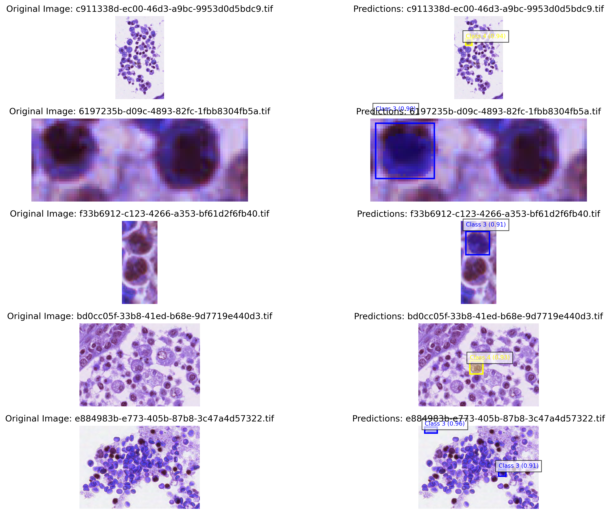

# Visual Recognition using Deep Learning Homework 3 Report

[GitHub Repository link](https://github.com/dytsou/vrdl2025/tree/master/hw3)

## 1. Introduction

This report presents our method for cell instance segmentation using Mask R-CNN, tailored for microscopy image analysis. The model effectively combines a state-of-the-art architecture with advanced memory optimization and training strategies to segment individual cells precisely.

## 2. Model Architecture

### 2.1 Backbone Architectures

We evaluated two backbone architectures:

* **ResNet50**: A widely-used backbone integrated with Feature Pyramid Network (FPN).
* **ResNet50\_v2**: An optimized variant of ResNet50 with improved feature extraction capabilities, resulting in better segmentation accuracy and training stability.

### 2.2 Architectural Enhancements

To specifically target cell segmentation, we introduced several optimizations:

* **Anchor Sizes**: Reduced sizes `(8, 16, 32, 64, 128)` tailored for smaller cell sizes.
* **Aspect Ratios**: Expanded to `(0.5, 1.0, 2.0)` for comprehensive coverage of diverse cell shapes.
* **Max Detections**: Increased to `200` detections per image.
* **Non-Maximum Suppression (NMS)**: Threshold lowered to `0.3` for enhanced instance discrimination.

## 3. Methodology and Technical Improvements

### 3.1 Data Preprocessing

We structured the data into distinct training and testing directories. The data comprises colored microscopy images with corresponding segmentation masks for four cell classes (class1 to class4). Each cell instance is uniquely encoded in masks for precise identification.

### 3.2 Training Strategies

The training regimen included:

* **Mixed Precision Training**: Employed `torch.amp` to accelerate computation and reduce memory usage.
* **Gradient Clipping**: Utilized to maintain numerical stability, with a max norm of 10.
* **Optimizer and Scheduler**: AdamW with weight decay (1e-4), combined with a CosineAnnealingLR scheduler.
* **Data Augmentation**: Elastic transformations with parameters α=30 and σ=12, applied with a 30% probability.

### 3.3 Memory Management

Memory optimization involved:

* Explicit cache clearing using `torch.cuda.empty_cache()`.
* Reduction of batch size from 4 to 2 to mitigate GPU memory overflow.

## 4. Training Details

* **Epochs**: `50`
* **Batch Size**: `2` (optimized for GPU constraints)
* **Learning Rate**: `1e-4`
* **Mixed Precision**: Enabled
* **Checkpointing**: Model saved based on best validation Mean Average Precision (mAP).

## 5. Inference

The inference pipeline utilized thresholds:

* **Confidence Threshold**: 0.99
* **Mask Threshold**: 0.6

Results were outputted in a COCO-compatible JSON file with masks encoded using Run-Length Encoding (RLE).

## 6. Results

### 6.1 Performance Evaluation

The evaluation employed Mean Average Precision (mAP), considering multiple Intersection-over-Union (IoU) thresholds. The mAP\@50 was specifically emphasized due to its common usage in segmentation tasks.

| Backbone     | mAP  | mAP\@50 |
| ------------ | ---- | ------- |
| ResNet50     | 0.28 | 0.30    |
| ResNet50\_v2 | 0.30 | 0.32    |

### 6.2 Qualitative Analysis

Visual inspection demonstrated accurate cell boundary delineation and high-confidence segmentation, even in densely populated regions. Representative predictions displayed precise bounding boxes, clear segmentation masks, and accurate classification.

### 6.3 Qualitative Visualization

The following figure shows qualitative results of our Mask R-CNN model on several cell images, as generated in the visualization part of the notebook. The left column displays the original images, while the right column shows the model's predictions, including bounding boxes, class labels, and confidence scores.

## 7. Challenges and Solutions

* **Memory constraints**: Addressed through mixed precision training and reduced batch sizes.
* **Deprecated APIs**: Updated from deprecated `torch.cuda.amp` to the current `torch.amp` API.
* **Excessive detections**: Adjusted detection threshold to refine mAP calculation accuracy.

## 8. Conclusion

Our Mask R-CNN implementation effectively addresses cell segmentation challenges by leveraging optimized architectures, strategic training practices, and rigorous memory management. This method provides a robust solution for automated cell analysis in biological imaging.

## 9. References

\[1] K. He, G. Gkioxari, P. Dollár, and R. Girshick, "Mask R-CNN," in *Proceedings of the IEEE International Conference on Computer Vision (ICCV)*, 2017, pp. 2961–2969.

\[2] PyTorch Vision, "Datasets, Transforms and Models specific to Computer Vision," GitHub Repository. \[Online]. Available: [https://github.com/pytorch/vision](https://github.com/pytorch/vision)

\[3] A. Buslaev et al., "Albumentations: Fast and Flexible Image Augmentations," *Information*, vol. 11, no. 2, p. 125, 2020.

\[4] COCO Consortium, "COCO: Common Objects in Context," \[Online]. Available: [https://cocodataset.org](https://cocodataset.org)

\[5] PyTorch Documentation, "Automatic Mixed Precision (AMP)." \[Online]. Available: [https://pytorch.org/docs/stable/amp.html](https://pytorch.org/docs/stable/amp.html)
