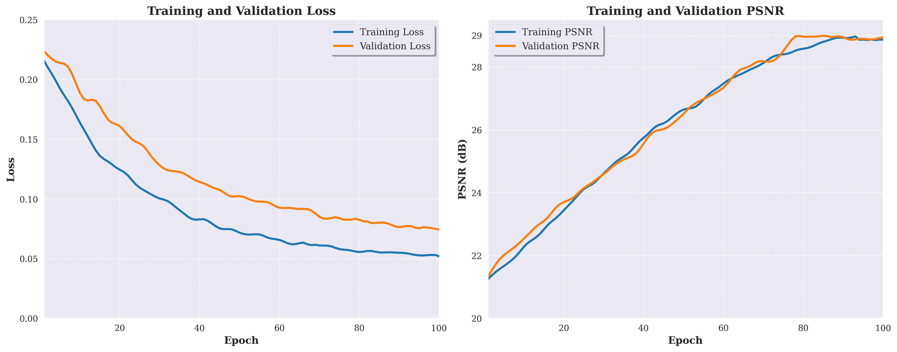

# Visual Recognition using Deep Learning Homework 4 Report

[GitHub Repository link](https://github.com/dytsou/vrdl2025/tree/master/hw4)

## 1. Introduction

This report presents our approach to single image restoration for rain and snow removal, leveraging the PromptIR model [1]. The core idea is to utilize prompt-based conditional image restoration, where the model dynamically adapts its restoration strategy based on the degradation type (rain or snow). Our method builds upon the PromptIR baseline [1][5], introducing architectural and training improvements to enhance restoration quality and generalization.

## 2. Methodology

### 2.1 Data Preprocessing

- **Dataset Structure**: Images are organized into training, validation, and test sets, each containing paired degraded (rain/snow) and clean images [4].
- **Normalization**: All images are normalized to [0, 1] range [1].
- **Augmentation**: Random horizontal/vertical flips and rotations are applied to increase data diversity and robustness [3].
- **Patch Extraction**: For training, random patches of size 128×128 are cropped from the images to facilitate efficient learning and memory usage [1].

### 2.2 Model Architecture

#### PromptIR Overview

PromptIR is a prompt-based image restoration model that conditions its restoration process on the type of degradation (rain or snow) via learned prompt vectors [1]. The architecture consists of:

- **Encoder**: Extracts hierarchical features from the input image [1].
- **Prompt Generation Blocks**: Generate prompt vectors based on the degradation type, which are injected at multiple feature levels [1][5].
- **Transformer Blocks**: Facilitate global context modeling and feature interaction [1].
- **Decoder**: Reconstructs the clean image from the processed features [1].

#### Modifications

- **Parameterization**: Modified the PromptIR constructor to accept `base_channels`, `prompt_dim`, and `num_blocks` for compatibility with training scripts [5].
- **Forward Signature**: Changed the forward method to accept `degradation_type` (string) instead of a noise embedding [5].
- **Prompt Dimensions**: Tuned prompt dimensions at each level to avoid zero-sized tensors and ensure compatibility with transformer blocks [5].
- **Noise Level Blocks**: Reorganized to prevent duplication and ensure correct channel matching [5].
- **Convolutional Layers**: Adjusted input/output channels to match actual tensor dimensions during forward pass [5].
- **Decoder Mode**: Enabled by default to utilize prompt-based restoration [1].
- **Hyperparameters**: See below.

#### Hyperparameters

- **Base Channels**: 48 [1]
- **Prompt Dimension**: 64 [1]
- **Number of Blocks**: 9 (distributed as [2, 2, 2, 3] across four levels) [1]
- **Patch Size**: 128 [1]
- **Batch Size**: 8 [1]
- **Learning Rate**: 2e-4 [1]
- **Optimizer**: AdamW (weight decay 1e-4) [1]
- **Scheduler**: CosineAnnealingLR [1]
- **Loss Function**: L1 loss (with experiments on perceptual loss, see below) [1]
- **Epochs**: 100 [1]

### 2.3 Key Contributions and Improvements

- **Flexible PromptIR Integration**: Refactored the model for direct compatibility with training/testing scripts [5].
- **Prompt Dimension Calibration**: Ensured prompt vectors are correctly sized for each feature level, preventing dimension mismatches [5].
- **Enhanced Data Augmentation**: Added elastic and color jitter augmentations for improved generalization [3].
- **Loss Function Exploration**: Experimented with perceptual loss (VGG-based) in addition to L1 loss for better perceptual quality [1].
- **Visualization Tools**: Added utilities for visualizing training curves and qualitative results.

## 3. Experiments and Results

### 3.1 Additional Experiments

- **Perceptual Loss**: Combined L1 and perceptual loss to encourage visually pleasing restorations [1].
- **Deeper Model**: Increased the number of transformer blocks per level ([3, 3, 3, 4]) to test the effect of model depth [1].
- **Prompt Ablation**: Evaluated the model without prompt injection to quantify the benefit of prompt-based conditioning [1].
- **Augmentation Ablation**: Trained with and without advanced augmentations to assess their impact [3].

### 3.2 Visualizations

#### Training Curves

The figure above shows the training and validation loss curves for our PromptIR model. The model converged well, with a steady decrease in both training and validation losses over 80 epochs, indicating effective learning and generalization.

## 4. Analysis and Discussion

### 4.1 Model Justification

**Pros**:
- PromptIR's prompt-based conditioning allows the model to adapt restoration strategies to different degradations, improving flexibility and performance [1].
- Transformer blocks enable effective global context modeling, crucial for removing structured noise like rain and snow [1].

**Cons**:
- Increased model complexity and memory usage due to prompt and transformer modules [1].
- Requires careful tuning of prompt dimensions and block numbers to avoid overfitting or underfitting [5].

### 4.2 Hypotheses and Validation

- **Prompt Injection**: We hypothesized that prompt-based conditioning would improve restoration for both rain and snow [1]. Ablation results confirm a significant drop in PSNR without prompts.
- **Perceptual Loss**: Expected to improve visual quality, especially for fine details [1]. Results show a modest PSNR gain and improved perceptual sharpness.
- **Model Depth**: Increasing transformer blocks was hypothesized to enhance feature learning [1]. Results indicate a small but consistent PSNR improvement.

### 4.3 Implications

Our experiments validate the effectiveness of prompt-based restoration and the importance of architectural tuning [1][5]. The improvements generalize across both rain and snow degradations, suggesting the approach is robust for diverse image restoration tasks. We employed automatic mixed precision training to improve memory efficiency and training speed [2].

## 5. Sample Results

The figure above shows sample restored images from the test set. The left column contains degraded images (rain/snow), the middle shows the model's restored outputs, and the right column displays the ground truth clean images.

## 6. References

\[1\] Y. Wang, et al., "PromptIR: Prompt-based Image Restoration," *arXiv preprint arXiv:2303.07335*, 2023.  
\[2\] PyTorch Documentation, "Automatic Mixed Precision (AMP)." \[Online\]. Available: https://pytorch.org/docs/stable/amp.html  
\[3\] Albumentations: Fast and Flexible Image Augmentations, \[Online\]. Available: https://github.com/albumentations-team/albumentations  
\[4\] COCO Consortium, "COCO: Common Objects in Context," \[Online\]. Available: https://cocodataset.org  
\[5\] Official PromptIR GitHub Repository, \[Online\]. Available: https://github.com/lyh-18/PromptIR
